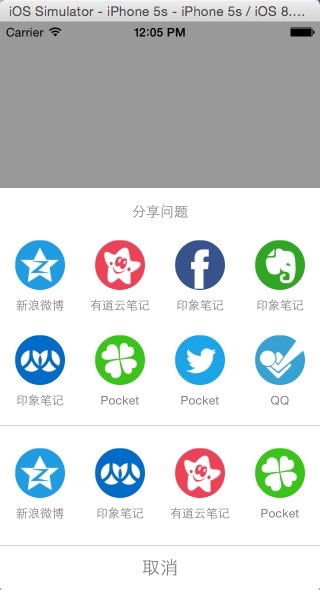
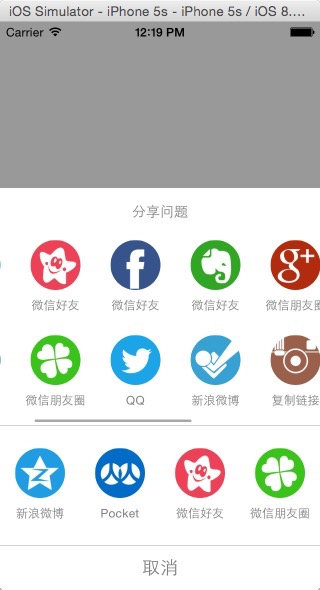

### 这是啥？

一个上下两栏的事件面板

### 解决了啥

有些时候想定义一个类似UIActiveityController的面板，或者用于分享，或者用于其他事件，但好像没有合适的，这个时候你恰巧看到咱这个库，你就不用自己写了，代码简单易懂，下来看看，你看不了吃亏，看不了上当。

### 有啥特点？

 - 两步集成
 - 可以无限添加Item


### 没图你说啥





### 那么，怎样用？

```
- (void)onClick:(id)onClick
{
  [self.eventView showInView:self.view];
}

- (SFEventView *)eventView
{
  if(!_eventView)
  {

    NSMutableArray *arr = [@[] mutableCopy];
    NSMutableArray *bottomArray = [@[] mutableCopy];

    NSArray *titles = @[@"微信好友", @"微信朋友圈", @"印象笔记", @"QQ", @"Pocket", @"复制链接", @"新浪微博", @"有道云笔记"];

    for(int i = 5; i < 20; i++)
    {
      NSString *imgName = [NSString stringWithFormat:@"sns_icon_%d", i+1];
      UIImage *img = [UIImage imageNamed:imgName];
      NSString *title = titles[arc4random_uniform(titles.count)];

      SFEventItemActionBlock action = ^(SFEventItem *item)
      {
        NSLog(@"%@", item.text);
      };

      SFEventItem *item = [[SFEventItem alloc] initWithText:title
                                                       type:@"test"
                                                       image:img
                                                      action:action];


      [arr addObject:item];
    }

    for(int i = 0; i < 1; i++)
    {
      NSString *imgName = [NSString stringWithFormat:@"sns_icon_%d", i+20];
      UIImage *img = [UIImage imageNamed:imgName];

      SFEventItem *item = [[SFEventItem alloc] initWithText:@"weixin"
                                                       type:@"weixin"
                                                       image:img
                                                      action:nil];
      [bottomArray addObject:item];
    }

    _eventView = [[SFEventView alloc] initWithTitle:@"分享问题"
                                           topItems:arr
                                        bottomItems:bottomArray];
  }
  return _eventView;
}
```


### 有没有Pods？

`pod search SFEventView`
`pod SFEventView`
你懂得。

### 未来有啥计划？

 - 支持动态添加Item
 - 做成可配置的，想要几行就几行 


### 联系我？

mail: shiweifu@gmail.com  
wechat: kernel32

